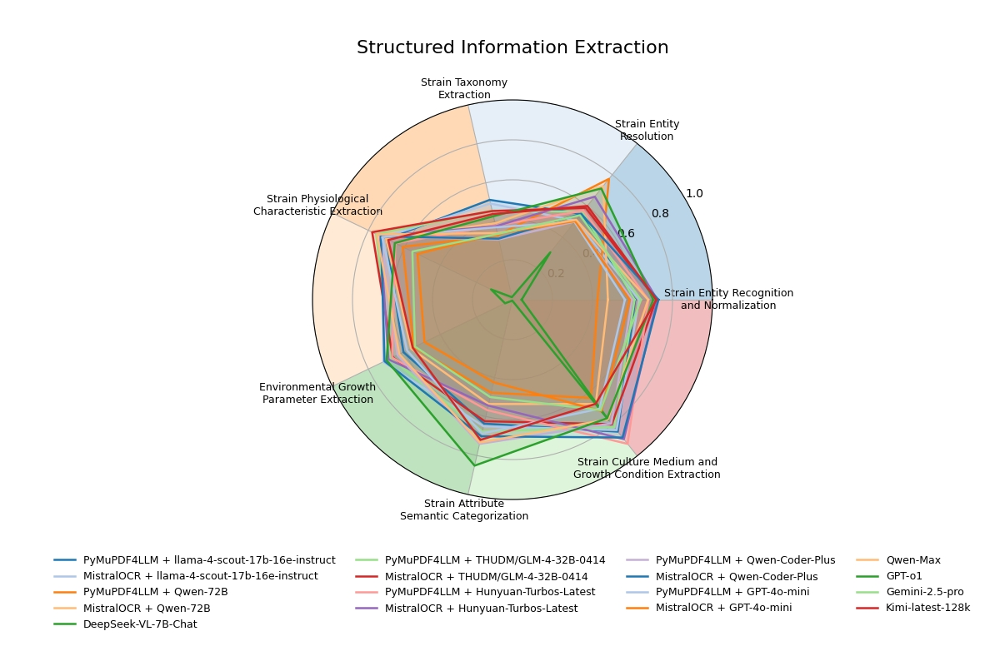
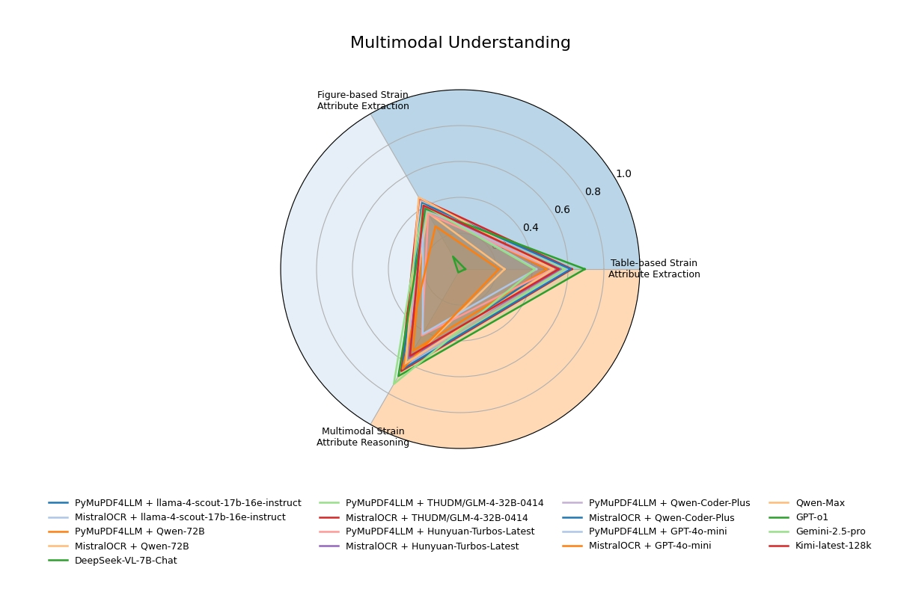
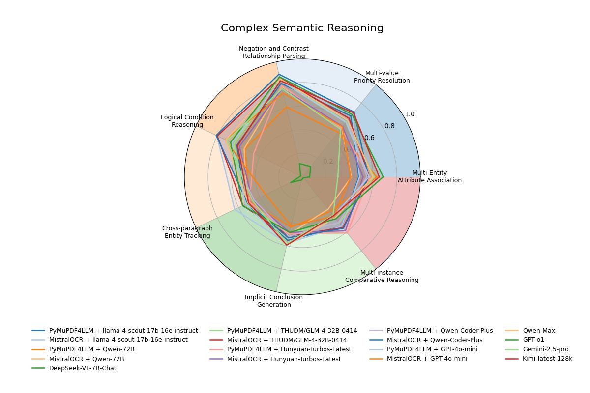
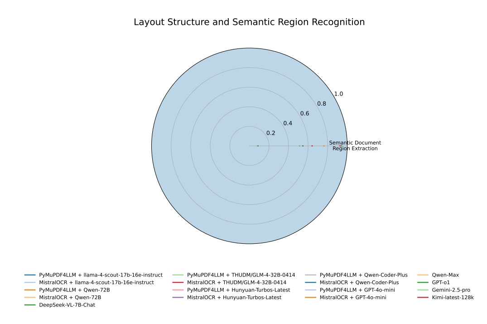

# MicrobeQuest

## 🧠 Introduction

**MicrobeQuest** is the **first comprehensive, multimodal benchmark** specifically designed for microbiology-related information retrieval. It pushes the boundaries of scientific document understanding in a domain where information is dispersed across **text, tables, figures, and layout structures**.

We curated **10,176 expert-annotated QA pairs** based on real academic literature and public microbiology databases. MicrobeQuest systematically evaluates model performance across **18 real-world tasks**, including structured extraction, multimodal reasoning, and layout-based understanding.

---

## 🔄 Updates

* **May 2025**: Initial release of MicrobeQuest benchmark with 10,176 annotated QA pairs.
* **Upcoming**: Online leaderboard, full paper, and prompt ablation study results.

---

## 📊 Task Types

MicrobeQuest includes diverse tasks grouped into four main categories:

1. **Structured Information Extraction**

   * Strain Entity Recognition and Normalization
   * Strain Entity Resolution
   * Strain Taxonomy Extraction
   * Strain Physiological Characteristic Extraction 
   * Environmental Growth Parameter Extraction
   * Strain Attribute Semantic Categorization
   * Strain Culture Medium and Growth Condition Extraction

2. **Multimodal Reasoning**

   * Table-based Strain Attribute Extraction
   * Figure-based Attribute Extraction
   * Multimodal Strain Attribute Reasoning

3. **Complex Semantic Reasoning**

   * Multi-Entity Attribute Association 
   * Multi-value Priority Resolution
   * Negation and Contrast Relationship Parsing 
   * Logical Condition Reasoning 
   * Cross-Paragraph Entity Tracking 
   * Implicit Conclusion Generation 
   * Multi-Instance Comparative Reasoning

4. **Layout Structure and Semantic Region Recognition**
   * Semantic Document Region Extraction

---

## 🏆 Benchmark Results

We evaluated **17 state-of-the-art large language model systems** on MicrobeQuest. Highlights:

* **GPT-o1**: Best performance in **structured information extraction**.
* **GPT-o1**: Best performance in **multimodal reasoning**.
* **MistralOCR + Qwen-Coder-Plus**: Strong in **complex semantic reasoning**.
* **Qwen-Max**: Best in **layout structure recognition**.

Despite GPT-o1 ranking first overall, **differences with runner-up models are marginal** in several categories. Some tasks (e.g., strain classification, figure/table interpretation) remain **highly challenging** and domain-dependent.


<!-- Insert performance chart -->

<!-- Performance Chart -->
<!-- Performance Chart -->

<p align="center">
  
  
</p>
<p align="center">
  
  
</p>

---

## 📊 Mini-Leaderboard 

| Model                                              | Overall F1 |
|----------------------------------------------------|------------|
| PyMuPDF4LLM + llama-4-scout-17b-16e-instruct (M1)  | 61.6%      |
| MistralOCR + llama-4-scout-17b-16e-instruct  (M2)  | 62.9%      |
| PyMuPDF4LLM + Qwen-72B  (M3)                       | 52.9%      |
| MistralOCR + Qwen-72B   (M4)                       | 52.9%      |
| DeepSeek-VL-7B-Chat  (M5)                          | 10.9%      |
| PyMuPDF4LLM + THUDM/GLM-4-32B-0414 (M6)            | 62.7%      |
| MistralOCR + THUDM/GLM-4-32B-0414 (M7)             | 63.8%      |
| PyMuPDF4LLM + Hunyuan-Turbos-Latest (M8)           | 58.9%      |
| MistralOCR + Hunyuan-Turbos-Latest (M9)            | 59.0%      |
| PyMuPDF4LLM + Qwen-Coder-Plus (M10)                | 60.8%      |
| MistralOCR + Qwen-Coder-Plus (M11)                 | 63.4%      |
| PyMuPDF4LLM + GPT-4o-mini (M12)                    | 58.6%      |
| MistralOCR + GPT-4o-mini (M13)                     | 49.1%      |
| Qwen-Max (M14)                                     | 62.6%      |
| GPT-o1 (M15)                                       | 66.2%      |
| Gemini-2.5-pro (M16)                               | 53.7%      |
| Kimi-latest-128k (M17)                             | 61.9%      |

*See the full leaderboard on the [paper](#) for detailed task-wise results.*

---

## 🚀 Quick Start

1. Installation
   First, clone the `MicrobeQuest` repository:

```bash
git clone https://github.com/acl-submission/MicrobeQuest.git
```

Then, install all required dependencies with a single command:

```bash
pip install -r requirements.txt
```

2. Download Source PDFs
   Due to copyright restrictions, we cannot directly distribute the original PDF files. You need to follow the instructions in the README to download the corresponding PDFs manually and place them in the `src/data/raw_pdfs` directory.

Additionally, since the evaluation uses images extracted from the PDFs, make sure to generate and save the images into the `src/data/images` folder.

We provide a list of relevant PDFs in `urls.json` along with a downloader script `pdf_downloader.py` to help fetch the source PDFs and convert to images:

```bash
python pdf_downloader.py
```

> ⚠️ Note: If some files cannot be downloaded due to copyright restrictions, please manually obtain and place them into the appropriate directory.

3. Model Configuration

* **API-based Models:**
  Edit your API key and model configuration in `config.yaml`.

* **Local Models:**
  Ensure your model is deployed locally, then update the model name and path in the config file accordingly.

4. Run Evaluation
   Run the following script to evaluate your model’s predictions against the benchmark:

```bash
python run_benchmark.py
```

---


## 📨 Contact


## 📚 Citation


---

